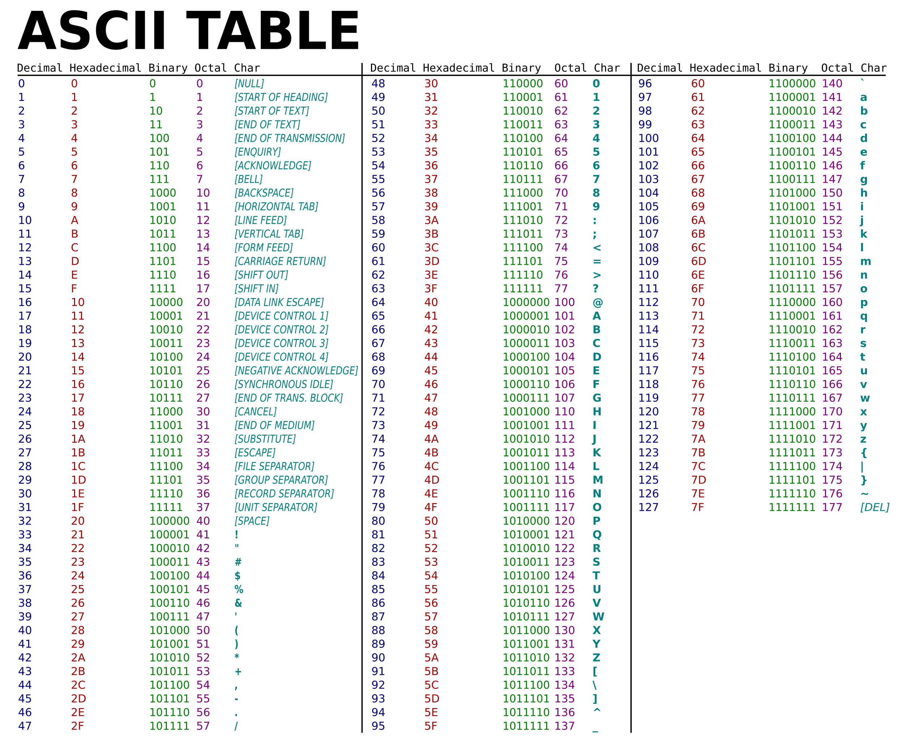

## Binary is rather simple once you get the hang of it. 

You will need an ASCII Table in order to convert these binary codes into characters. I
have attached one below.

Essentially, with your 8 digits, the last one represents 2^0, or 0

The second to last digit represents 2^1, or 2

The third to last digit represents 2^2, or 4

The fourth to last digit represents 2^3, or 8

The fifth to digit represents 2^4, or 16

The sixth digit represents 2^5, or 32

The seventh digit represents 2^6, or 64

The eighth digit, which is the first number on the left, represents
2^7, or 128

So, if the binary code is 01001010, you would see that the second to
last, fourth to last, and 7th to last digit are "on"

This means we will add their values together to find the code\'s ascii
value.

This will equate to 2 + 8 + 64, which is 74.

74 on the ASCII table represents the letter J, specifically a
capitalized J.

When given a series of binary codes, you will repeat this process in
order to decipher it into english and integers. The ASCII table makes
this process very quick.

Hope this helps!

[Return Home](https://github.com/kakfhk/tutorial/blob/main/README.md)
